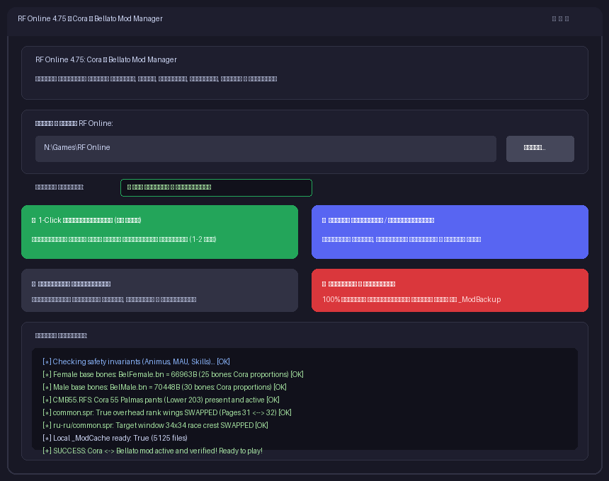

# RF Online 4.75: Cora <--> Bellato Full Mod (4game / VK Play / Innova)

[-007acc.svg)](#)
[](#)
[](https://github.com/wyrtensi/rfonline-vkplay-bellato-cora-mod/releases)
[](#)
[](#)
[](#)
[](LICENSE)

Комплексный инструмент автоматизации и мод полной двусторонней визуальной и звуковой замены рас **Кора (Cora)** $\longleftrightarrow$ **Беллато (Bellato)** для официального клиента RF Online 4.75 (сборки Innova / 4game / VK Play).

Поставляется в виде **единого автономного приложения `RFOnline_Cora_Bellato_Mod.exe` с графическим интерфейсом (GUI)** — установка Python или запуск `.bat` скриптов больше не требуются!

Мод позволяет играть за персонажа Коры с внешним видом, бронёй, пропорциями, скелетом, свечениями, иконками и звуками Беллато (и наоборот), полностью сохраняя клиент-серверную стабильность, оригинальную механику классов, магию и защиту от обновлений.

---

## 🖥️ Графический интерфейс (GUI) в релизном .EXE

Больше никаких черных консолей и батников — приложение запускается двойным кликом:



### Основные функции интерфейса:
- **Автоопределение папки игры:** программа автоматически находит установленный клиент RF Online на дисках `N:`, `C:`, `D:` или позволяет выбрать папку через кнопку **«Обзор...»**.
- **Индикатор статуса:** наглядно показывает текущее состояние клиента:
  - `✅ МОД АКТИВЕН И УСТАНОВЛЕН`
  - `🔹 ОРИГИНАЛЬНАЯ ИГРА (БЕЗ МОДА)`
  - `❌ ПАПКА НЕ НАЙДЕНА`
- **⚡ 1-Click Восстановление (из кэша):**
  - **Полностью заменяет `Apply-Mod.bat` прямо в окне программы!**
  - Если лаунчер 4game / VK Play обновил клиент или вы нажали «Починить игру», достаточно нажать эту кнопку — мод мгновенно восстановится из `_ModCache/` за **1-2 секунды** без долгого пересчета.
- **🎮 Полная установка / Переустановка:**
  - Создает резервную копию оригиналов в `_ModBackup/`.
  - Синтезирует адаптивные скелеты, свапает меши, текстуры, плащи, эффекты, звуки и спрайты.
  - Формирует локальный кэш быстрого восстановления.
- **🔍 Проверить целостность:**
  - Полная диагностика клиента: проверка контрольных размеров мешей, скелетов, шлемов Палмас 55, крыльев ЧВ и исключений безопасности.
- **🔄 Откатить к оригиналу:**
  - 100% возврат всех файлов игры в первозданное заводское состояние из резервной копии.
- **Интерактивный журнал:** вывод подробных шагов работы в реальном времени с цветовой индикацией.

---

## 🎮 Ключевые возможности мода

| Категория | Что заменяется (Cora $\longleftrightarrow$ Bellato) |
|---|---|
| **3D-модели и текстуры брони** | Все сеты с 1 по 75 ур., включая Белую броню, Реликты, Мастер, сеты 50, 53, 55 (Палмас), 65, 70 (Орихаркон), 75 (Баалзебуб), Драконьи доспехи, шлемы, визоры и маски. |
| **Скелеты и пропорции** | Адаптивные скелеты `.bn`, удовлетворяющие встроенному валидатору костей `RF_Online.exe`: BelFemale (25 костей), CorFemale (38 костей), BelMale (30 костей), CorMale (29 костей). |
| **Анимации** | Походка, бег, стойки покоя, боевые стойки, обычные атаки, подбор предметов, прыжки, эмоции. Сохранены анимации метания топоров (RAXETHROW). |
| **Плащи и антигравы** | Корректный обмен антигравов и крыльев: у Коры появляются летающие сферы Беллато (с привязкой к дамми `BALL00..BALL03`), у Беллато — тёмные крылья Коры. |
| **Свечения и эффекты** | Свечение сетов брони (`Chef/Eff/Armor/`), выхлоп бустеров (`Effect/item_8/Booster_CLOAK/`), ауры наград ЧВ (`Effect/Character_3/ranking_reward/`), эффекты Патриархов, Архонтов и ГМ (`MagicSptList.spt`). |
| **Иконки в инвентаре** | Беспотерьный побайтовый обмен 560 пар блоков DXT1 ($64 \times 64$, 2048 байт) в `item.spr` (шлемы, торсы, штаны, перчатки, ботинки, плащи). |
| **Ранги и гербы в интерфейсе** | Розово-золотые крылья Беллато 1-го ранга над головой (стр. 31/32, 34/35 `common.spr`), гербы рас в окне цели ($34 \times 34$ и $55 \times 55$ в `common.spr`, `pvp.spr`, `charinfo.spr`). |
| **Озвучка и музыка** | Клики по персонажам, боевые выкрики расы (`Snd/Character/`) и фоновая музыка баз (`Snd/BGM/`). |

---

## 🛡️ Строгие инварианты и безопасность (Что НЕ меняется)

1. **MAU (Бронемэны Беллато):** Катапульты, Голиафы и Баллисты остаются строго у расы Беллато. Мехи Коре не передаются.
2. **Анимусы (Animus):** Паймон, Инанна, Геката и Исида остаются строго у расы Кора.
3. **Магия Тьмы и Света:** Магия Тьмы (Dark Force) остаётся у Коры, магия Света (Holy Force) — у Беллато. Никаких рассинхронизаций пакетов.
4. **Классовые скиллы:** Архивы профессиональных скиллов 30 и 40 уровней (`*2CA.RFS`) и баффов (`*ETA.RFS`) строго изолированы во избежание вылетов клиента (crash/T-pose).
5. **Акретия (Accretia):** Ресурсы Акретии не затрагиваются ни на один байт.
6. **100% обратимость:** В любой момент можно выполнить полный откат к оригинальному состоянию клиента кнопкой **«Откатить к оригиналу»** или флагом `--rollback`.

---

## 🚀 Быстрый старт (для игроков)

1. Перейдите в раздел **[Releases](../../releases)** и скачайте `RFOnline_Cora_Bellato_Mod.exe`.
2. Запустите файл `RFOnline_Cora_Bellato_Mod.exe` (двойным кликом).
3. Проверьте путь к игре (если папка не определилась автоматически, нажмите **«Обзор...»**).
4. Нажмите большую синюю кнопку **«🎮 Полная установка / Переустановка»**.
5. Дождитесь надписи `[+] УСТАНОВКА УСПЕШНО ЗАВЕРШЕНА!` в окне журнала.
6. Запускайте игру через лаунчер Фогейм / VK Play и наслаждайтесь игрой!

> [!TIP]
> **После любого обновления игры в лаунчере:** просто откройте `RFOnline_Cora_Bellato_Mod.exe` и нажмите зеленую кнопку **«⚡ 1-Click Восстановление»** (занимает 1 секунду).

---

## 💻 Консольный режим (CLI для продвинутых пользователей)

`RFOnline_Cora_Bellato_Mod.exe` и `cora_bellato_patcher.py` поддерживают единый набор CLI-аргументов для автоматизации:

```powershell
# Применить полную модификацию
.\RFOnline_Cora_Bellato_Mod.exe --apply

# Быстро восстановить из кэша за 1 секунду
.\RFOnline_Cora_Bellato_Mod.exe --restore

# Проверить целостность и статус
.\RFOnline_Cora_Bellato_Mod.exe --verify

# Полный откат к оригинальной игре
.\RFOnline_Cora_Bellato_Mod.exe --rollback

# Принудительная чистая переустановка
.\RFOnline_Cora_Bellato_Mod.exe --force

# Запуск с указанием нестандартного пути
.\RFOnline_Cora_Bellato_Mod.exe --game-dir "D:\Games\RF Online" --apply

# Принудительный запуск GUI
.\RFOnline_Cora_Bellato_Mod.exe --gui
```

---

## 📁 Структура репозитория

```text
rfonline-vkplay-bellato-cora-mod/
├── RFOnline_Cora_Bellato_Mod.exe # Автономный релизный бинарник с GUI и CLI (в Releases)
├── cora_bellato_patcher.py       # Главный исходный код патчера, GUI и бэкапа
├── icon.ico                     # Оригинальная иконка приложения
├── Apply-Mod.bat                # Опциональный командный файл восстановления (для любителей CLI)
├── Apply-Mod.ps1                # Опциональный PowerShell-скрипт восстановления
├── tools/
│   └── cbb_msh.py               # Инструмент реверс-инжиниринга и импорта/экспорта .MSH для Blender
├── docs/
│   ├── MODDING_GUIDE.md         # Полная техническая энциклопедия (77 КБ реверс-инжиниринга)
│   └── FIX_WALKTHROUGH.md       # Разбор исправлений (штаны Палмас 55, крылья ЧВ, шлемы, таргет)
├── LICENSE                      # Лицензия MIT
├── .gitignore                   # Исключение игровых бинарных ассетов из репозитория
└── README.md                    # Данная документация
```

---

## 🔍 Решённые инженерные проблемы движка RF Online

Подробный разбор механик и форматов описан в [MODDING_GUIDE.md](docs/MODDING_GUIDE.md) и [FIX_WALKTHROUGH.md](docs/FIX_WALKTHROUGH.md):

1. **Валидатор скелетов R3Engine (0x00608010):**  
   Движок игры жёстко проверяет точное количество костей при инициализации расы (Кора Ж — 38, Кора М — 29, Беллато Ж — 25, Беллато М — 30). Простое переименование файлов скелетов приводило к моментальному крашу. Реализован синтез гибридных скелетов: карликовый скелет с добавлением фиктивных концевых костей (Dummy Nub) и высокий эльфийский скелет со слиянием второстепенных костей.
2. **Невидимые штаны и шлемы Палмас 55 (Смещение ID):**  
   В оригинальных архивах `*B55.RFS` идентификаторы мешей Беллато (179/187/195) не совпадали с идентификаторами Коры (203/211/219). Внедрена виртуальная трансляция ID внутри VFS архивов RFS.
3. **Летающие сферы Беллато:**  
   Орбитальные сферы бустеров Беллато требуют согласования 3 независимых компонентов: дамми-узлов в геометрии `.MSH` (`BALL00..BALL03`), ключевых кадров траектории в `.RFS` анимаций и эмиттеров частиц в файлах эффектов `.EFF`.
4. **Своп значков рас в рамке таргета:**  
   Герб расы цели загружается из недокументированных блоков DXT1 $34 \times 34$ в конце файла `common.spr` (`sz - 3*2072` для Беллато, `sz - 2*2072` для Коры). Пропатчены все 4 копии файла в клиенте.

---

## 📄 Лицензия

Распространяется под свободной лицензией [MIT](LICENSE). Модификация предназначена исключительно для клиентской кастомизации интерфейса и графики.
