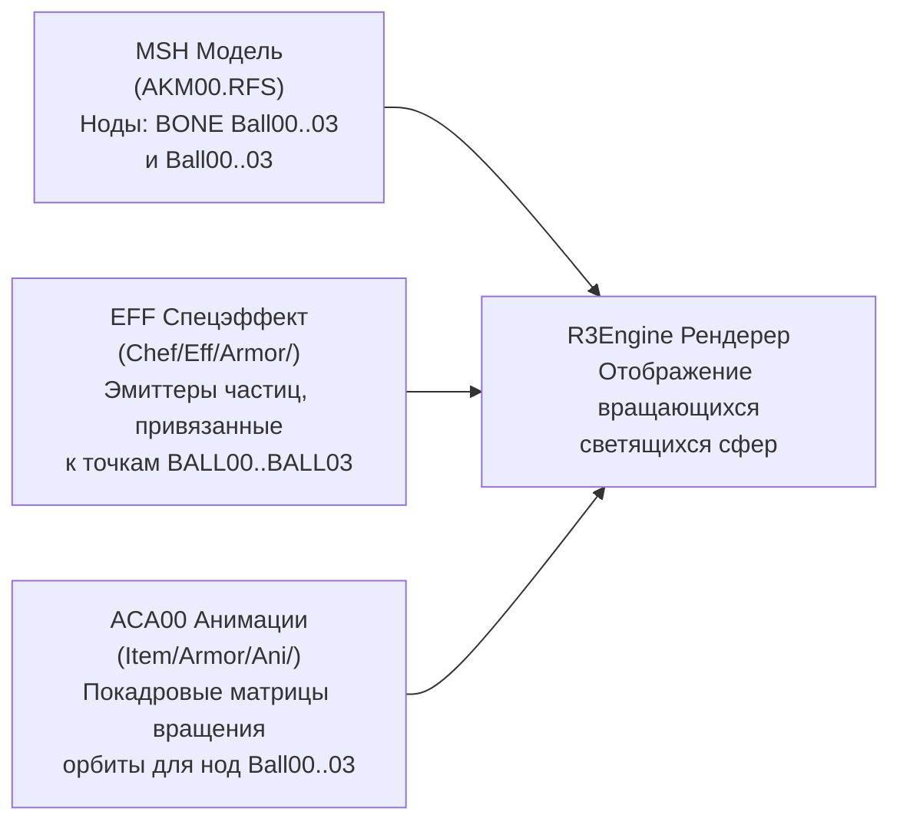

# Полная техническая энциклопедия и документация по модификации Cora <-> Bellato для RF Online 4.75

**Целевой клиент:** Innova / 4game (Иннова) RF Online v4.75 (сборка `0_2045077distrib22`)  
**Рабочий каталог:** Корневой каталог клиента игры RF Online (например, `C:\Games\RF Online`)  
**Движок игры:** CCR R3Engine (DirectX 9 / 32-bit x86 PE)  
**Авторы исследования:** Агентская инженерно-исследовательская группа Antigravity (DeepInvestigator & DeepCoder Pipeline)  
**Дата актуализации:** Сентябрь 2026 г.  
**Текущий статус мода:** Полностью реализован, протестирован и активен (`MODIFIED & ACTIVE`)

---

## Оглавление
1. [Введение и архитектурная концепция](#1-введение-и-архитектурная-концепция)
2. [Опровержение мифов и критический анализ (Claim vs Reality)](#2-опровержение-мифов-и-критический-анализ-claim-vs-reality)
3. [Реверс-инжиниринг бинарных форматов и структур данных](#3-реверс-инжиниринг-бинарных-форматов-и-структур-данных)
   - 3.1. [Алгоритм шифрования и дешифровки таблиц EDF (OdinTeam / CCR XOR)](#31-алгоритм-шифрования-и-дешифровки-таблиц-edf-odinteam--ccr-xor)
   - 3.2. [Структура таблиц брони `Item.edf` и картирование ID](#32-структура-таблиц-брони-itemedf-и-картирование-id)
   - 3.3. [Формат спрайтов `item.spr` и истинная организация страниц брони](#33-формат-спрайтов-itemspr-и-истинная-организация-страниц-брони)
   - 3.4. [Технология Lossless DXT1 Block Swap (535 пар без коллизий)](#34-технология-lossless-dxt1-block-swap-535-пар-без-коллизий)
   - 3.5. [Контейнеры RFS и виртуальная файловая система (VFS)](#35-контейнеры-rfs-и-виртуальная-файловая-система-vfs)
   - 3.6. [Мульти-расовые общие RFS-архивы: VFS Preservation & Payload Swap](#36-мульти-расовые-общие-rfs-архивы-vfs-preservation--payload-swap)
   - 3.7. [Архивы эффектов RPK и бинарная структура файлов свечения `.EFF`](#37-архивы-эффектов-rpk-и-бинарная-структура-файлов-свечения-eff)
   - 3.8. [Бинарная архитектура 3D-моделей `.MSH` (RIFF MESH vs MESH08, чанки, дамми-ноды и геометрия)](#38-бинарная-архитектура-3d-моделей-msh-riff-mesh-vs-mesh08-чанки-дамми-ноды-и-геометрия)
   - 3.9. [Архитектура плащей, ранцев и антигравов (Loose MSH vs Packed RFS)](#39-архитектура-плащей-ранцев-и-антигравов-loose-msh-vs-packed-rfs)
   - 3.10. [Механика летающих сфер Беллато (Связка MSH Dummies + EFF Emitters + ACA00 Keyframes)](#310-механика-летающих-сфер-беллато-связка-msh-dummies--eff-emitters--aca00-keyframes)
   - 3.11. [Алгоритмы 3D-масштабирования (`scale_msh`) и слияния узлов (`combine_msh`)](#311-алгоритмы-3d-масштабирования-scale_msh-и-слияния-узлов-combine_msh)
   - 3.12. [Архитектура статусных эффектов: Патриархи, Архонты и Гильдмастера (MagicSptList.spt, TheOne, GM_eff)](#312-архитектура-статусных-эффектов-патриархи-архонты-и-гильдмастера-magicsptlistspt-theone-gm_eff)
4. [Анализ игровых подсистем и механик](#4-анализ-игровых-подсистем-и-механик)
   - 4.1. [3D-модели, меши и текстуры брони (1–40LV, 50–75LV, Master, White, Dragon, Masks)](#41-3d-модели-меши-и-текстуры-брони)
   - 4.2. [Скелеты (`.bn`), валидатор костей движка `RF_Online.exe` и решение вылетов (Вариант 2)](#42-скелеты-bn-валидатор-костей-движка-rf_onlineexe-и-решение-вылетов-вариант-2)
   - 4.3. [Анимационный конвейер: почему *2CA и *ETA нельзя менять](#43-анимационный-конвейер-почему-2ca-и-eta-нельзя-менять)
   - 4.4. [Магия (Свет и Тьма): клиент-серверный барьер и визуализация](#44-магия-свет-и-тьма-клиент-серверный-барьер-и-визуализация)
   - 4.5. [Изоляция Анимусов (Animus) и Мехов (MAU)](#45-изоляция-анимусов-animus-и-мехов-mau)
   - 4.6. [Подсистема спецэффектов (свечение сетов, бустеры, ауры ЧВ, частицы)](#46-подсистема-спецэффектов-свечение-сетов-бустеры-ауры-чв-частицы)
   - 4.7. [Звуки, озвучка и музыка баз](#47-звуки-озвучка-и-музыка-баз)
5. [Анализ защиты лаунчера Innova / 4game и выживаемость мода](#5-анализ-защиты-лаунчера-innova--4game-и-выживаемость-мода)
6. [Полный сводный реестр заменяемых и исключаемых файлов](#6-полный-сводный-реестр-заменяемых-и-исключаемых-файлов)
7. [Архитектура инструмента автоматизации `cora_bellato_patcher.py`](#7-архитектура-инструмента-автоматизации-cora_bellato_patcherpy)
8. [Инструкция по эксплуатации и быстрому восстановлению (1-Click Recovery)](#8-инструкция-по-эксплуатации-и-быстрому-восстановлению-1-click-recovery)

---

## 1. Введение и архитектурная концепция

Задача модификации заключается в **полноценной двусторонней визуальной и звуковой замене расы Кора (Cora) на расу Беллато (Bellato)** и наоборот (взаимный своп), при которой:
- Персонажи Коры отображаются с телами, анимациями, походкой, стойками, всей броней (1–75 ур., Реликт, Мастер, Драконья, Белая, Маски), свечениями, иконками экипировки в инвентаре и озвучкой расы Беллато.
- Персонажи Беллато отображаются с телами, анимациями, броней, свечениями, иконками и голосами Коры.
- **Строгие инварианты и ограничения:**
  1. Мехи Беллато (MAU: Голиаф, Катапульта, Баллиста) **не переносятся**.
  2. Анимусы Коры (Геката, Инанна, Исида, Паймон) **остаются как есть**.
  3. Магия Тьмы остаётся у Коры, магия Света — у Беллато.
  4. Классовые скиллы профессий 30 и 40 уровней (`*2CA.RFS`, `*ETA.RFS`) не должны меняться местами или ломаться.
  5. Мод должен переживать обновления лаунчера и не требовать модификации исполняемого файла `RF_Online.exe` на диске.

### Выбор подхода: Замена путей vs Физический Swap файлов
В клиенте RF Online имена 3D-ресурсов формируются движком динамически по шаблонам (`CORFEMALE_ARMOR_UPPER_%02d.msh`). В таблицах данных `Item.edf` и `Resource.edf` прописаны жесткие идентификаторы моделей (`MeshID`), синхронизируемые сервером. Изменение структуры или путей в таблицах `.edf` на клиенте приводит к рассинхронизации клиент-серверного протокола, невозможности авторизации или бану со стороны античита.

**Вывод:** Единственно верным, стабильным и надежным решением является **двусторонний физический обмен ресурсов (Swap)** на уровне файловой системы клиента, синхронизированный с подменой полезной нагрузки (payload) общих RFS-архивов и беспотерьной пересадкой 2048-байтных блоков DXT1 в `item.spr`.

---

## 2. Опровержение мифов и критический анализ (Claim vs Reality)

В ходе углубленного реверс-инжиниринга `RF_Online.exe`, таблиц EDF и файловых структур были опровергнуты распространённые мифы:

### Миф 1: «Все иконки брони лежат на страницах 0 и 1 со смещениями +512, +768, +1024»
* **Реальность:** Страницы 0 и 1 содержат оружие (топоры, луки, мечи) и пустые блоки-заглушки `"NO IMAGE"`. Настоящая броня в RF Online разнесена строго по **отдельным страницам для каждого слота**:
  - **Страница 13:** Все шлемы и головные уборы.
  - **Страница 14:** Вся верхняя броня (торс).
  - **Страница 15:** Вся нижняя броня (штаны).
  - **Страница 16:** Все перчатки и рукавицы.
  - **Страница 17:** Вся обувь и ботинки.
* **Решение:** Реализован точный расчет координат для страниц 13–17 с обменом 104 пар на страницу (520 пар) плюс 15 пар на странице 0 и плащей (всего 535 пар).

### Миф 2: «Файлы скелетов (`BelFemale.bn` <-> `CorFemale.bn`) можно просто переименовать»
* **Реальность:** При простом обмене файлов игра мгновенно крашилась при входе в мир с ошибкой `Invalid Bone File.` -> `RequestQuitProgram`.
  Дизассемблирование функции `0x00608010` в `RF_Online.exe` показало, что движок содержит **жесткий валидатор количества костей**:
  - `BelFemale`: ровно 25 костей.
  - `CorFemale`: ровно 38 костей.
  - `BelMale`: ровно 30 костей.
  - `CorMale`: ровно 29 костей.
* **Решение:** Разработан **Вариант 2 адаптированных скелетов** (`SkeletonAdapter`), удовлетворяющий валидатор движка и одновременно передающий правильные пропорции, рост и позы.

### Миф 3: «Вся броня лежит в раздельных архивах `BF*.RFS` vs `CF*.RFS`»
* **Реальность:** Только броня 1–40 уровней лежит в раздельных архивах. Вся броня 50–75 уровней, сеты Dark, Реликт, Мастер, Белая броня и Маски хранятся в **12 мульти-расовых общих архивах** (`DARKM60.RFS`, `ORI70.RFS`, `ori6770.RFS`, `RFMASTER.RFS`, `WHITEM.RFS`, `NWHITEM.RFS`, `MASKM.RFS`, `PHNMM.RFS`, `PHNMM2.RFS`, `XMH.RFS`, `blktg_hm.RFS`, `NPH02.RFS`).
* **Решение:** Реализован алгоритм `swap_shared_rfs_internal`, обменивающий полезную нагрузку внутри общих архивов (204 пары мешей).

### Миф 4: «Анимации можно слепо обменять местами в папке `Character/Player/Ani/`»
* **Реальность:** Попытка обменять архивы `*2CA.RFS` (боевые классовые скиллы) и `*ETA.RFS` (баффы профессий) приводит к **100% крашу клиента или Т-позе персонажа**.
  - `BF2CA.RFS` (Беллато жен.) содержит 48 анимаций.
  - `CF2CA.RFS` (Кора жен.) содержит 22 анимации.
  - У них 0% совпадений по именам файлов! В `BFMOA.RFS` есть 8 анимаций броска топором (`RAXETHROW`), отсутствующих у Кор.
* **Решение:** Архивы `*2CA.RFS` и `*ETA.RFS` исключены из обмена, а в `*MOA.RFS` реализовано сохранение эксклюзивных анимаций `RAXETHROW`.

---

## 3. Реверс-инжиниринг бинарных форматов и структур данных

### 3.1. Алгоритм шифрования и дешифровки таблиц EDF (OdinTeam / CCR XOR)
Алгоритм расшифровки отреверсен из `RF_Online.exe` (функции по смещениям `0x1ee3dc`, `0x1ee760`, `0x1ee660`):

1. **Структура файла EDF:**
   - Байты `0..28` (29 байт): Сигнатура `RF Online by OdinTeam s(^O^)z`.
   - Байты `29..32` (4 байта): Длина зашифрованных данных $N$ (`uint32` little-endian).
   - Байты `33 .. 33+N-1`: Зашифрованное тело таблицы.
   - Байты `33+N .. 33+N+255` (256 байт): **Ключ шифрования $K[0..255]$**.
2. **Алгоритм разворачивания ключа (`0x1ee760`):**
   - **Фаза 1 (Маскирование):** Массив масок $M = [1, 2, 4, 8, 16, 32, 64, 128]$. Для каждого $i$ от 0 до 255: если $((i+1) \bmod 2) \ne 0$, то $K[i] = (K[i] - M[(i+1) \ \& \ 7]) \ \& \ \text{0xFF}$, иначе $K[i] = (K[i] + M[(i+1) \ \& \ 7]) \ \& \ \text{0xFF}$.
   - **Фаза 2 (Реверс массива):** $K[i] \leftrightarrow K[255 - i]$ для $i$ от 0 до 127.
   - **Фаза 3 (Попарный обмен байт):** $K[i] \leftrightarrow K[i+1]$ с шагом $i += 2$.
3. **Потоковая расшифровка тела (`0x1ee660`):**
   - Для каждого байта $i$ от 0 до $N-1$:
     $$kb = K[(i + 1) \ \& \ \text{0xFF}]$$
     $$\text{Decrypted}[i] = (\text{Encrypted}[i] - kb) \ \& \ \text{0xFF} \quad (\text{при флаге режима 1})$$
     $$\text{Decrypted}[i] = (\text{Encrypted}[i] + kb) \ \& \ \text{0xFF} \quad (\text{при флаге режима 0})$$

### 3.2. Структура таблиц брони `Item.edf` и картирование ID
В расшифрованном файле `Item.edf` находятся 6 таблиц предметов со следующими точными смещениями:
- **Таблица 0 (Оружие):** Смещение `0x30`
- **Таблица 1 (Верхняя броня / Upper):** Смещение `0x30e8` (7697 записей по 244 байта)
- **Таблица 2 (Нижняя броня / Lower):** Смещение `0x1cd92e` (7697 записей по 244 байта)
- **Таблица 3 (Перчатки / Gauntlet):** Смещение `0x398174` (7697 записей по 244 байта)
- **Таблица 4 (Обувь / Shoe):** Смещение `0x5629ba` (7697 записей по 244 байта)
- **Таблица 5 (Шлемы / Helmet):** Смещение `0x72d200` (8620 записей по 244 байта)

**Поля 244-байтной записи предмета:**
- `+0x00`: Численный код предмета (int32)
- `+0x04`: Внутреннее имя (строка 64 байта)
- `+0x44`: Требуемый уровень (int32)
- `+0x4C`: Битовая маска расы (0x01 = Bellato, 0x02 = Cora, 0x04 = Accretia)
- `+0x50`: **IconID предмета** (int32). Вычисляется как `(Page << 10) + Index`.
- `+0x54`: **MeshID / Индекс модели** (int32).

### 3.3. Формат спрайтов `item.spr` и истинная организация страниц брони
Файл [SpriteImage/ru-ru/item.spr](file:///n:/Games/RF%20Online/SpriteImage/ru-ru/item.spr) содержит 40 страниц текстурных листов.
- **Глобальный заголовок (12 байт):** `ver = "1.1f"`, `unknown = 1`, `num_pages = 40`.
- **Заголовок листа (24 байта):** `fourcc = "DXT1"`, `width = 2048`, `height = 2048`, `tile_w = 64`, `tile_h = 64`, `data_size = 2097152`.

**Истинная организация страниц брони и плащей в RF Online 4.75:**
| Страница | Слот экипировки | Таблица в `Item.edf` | Количество пар | Примечание |
|:---:|---|---|:---:|---|
| **13** | Шлемы / Головные уборы | Таблица 5 (`0x72d1fc`, 8620 зап.) | 120 пар | 63 (1–50 ур.) + 57 (53–75 ур., маски Мамона, Асмодея, визоры, драконьи) |
| **14** | Верхняя броня (Торс / Рубахи) | Таблица 1 (`0x30e4`, 7697 зап.) | 104 пары | 63 (1–50 ур.) + 41 (53–75 ур., Baal, Титан/Таурус, Master, Дракон, Ноль) |
| **15** | Нижняя броня (Штаны) | Таблица 2 (`0x1cd92a`, 7697 зап.) | 104 пары | Идентичная структура с верхней броней |
| **16** | Перчатки / Рукавицы | Таблица 3 (`0x398170`, 7697 зап.) | 104 пары | Идентичная структура с верхней броней |
| **17** | Обувь / Ботинки | Таблица 4 (`0x5629b6`, 7697 зап.) | 104 пары | Идентичная структура с верхней броней |
| **19** | Плащи, Антигравы и Бустеры | Таблица 7 (`0xcacf8a`, 2508 зап.) | 24 пары | Антигравы (154/155), Премиум (202/203), Золотые (217/219), Адептус/Инквизитор, Гефест/Урания, Дрэгонборн, Чёрный дракон |

### 3.4. Технология Lossless DXT1 Block Swap (560 пар без коллизий)
- В формате DXT1 каждый блок $4 \times 4$ пикселя сжат ровно в 8 байт.
- Иконка размером $64 \times 64$ пикселя состоит из $16 \times 16 = 256$ блоков (ровно **2048 байт**).
- Смещение $y$-й строки блоков внутри иконки на странице:
  $$\text{PitchBlocks} = \text{Width} / 4 = 512$$
  $$\text{Offset}(by) = \text{DataStart} + ((\text{Row} \times 16 + by) \times 512 + \text{Col} \times 16) \times 8$$
- **Разрешение исторической проблемы со смещением:**
  - В базе данных `DataTable/Item.edf` смещение между записями Беллато и Коры для сетов 1–50 уровней составляет ровно 252 записи. Предыдущая версия ошибочно применяла $+252$ непосредственно к номерам иконок на страницах спрайтов, из-за чего иконки заменялись пустыми заглушками «NO IMAGE» (индексы $357..1023$).
  - **Истинная адресация:** Внутри 244-байтной записи `Item.edf` по смещению `0x4c:0x4e` записан точный индекс тайла (`uint16`).
    - **Уровни 1–50 (Страницы 13–17):** Беллато занимает `1..63` (Воин: 1..21, Стрелок: 22..42, Маг: 43..63). Кора занимает `64..126` (Воин: 64..84, Стрелок: 85..105, Маг: 106..126). Смещение между Беллато и Корой строго $+63$ (`(i, i + 63)` для $i \in [1..63]$). Иконки Акретии (`127..189`) находятся в изолированном диапазоне и на 100% защищены от изменений.
    - **Высокоуровневая броня 50–75 ур. (Страницы 14–17):** 41 систематическая пара (F-тип `190..192 <-> 193..195`, Патриарх/Архонт `199..201 <-> 202..204`, 53–55 тип C/Баал/Иерарх `208..213 <-> 214..219`, Белые сеты `227..229 <-> 230..232`, 65 ур. Титан $\leftrightarrow$ Таурус `236..238 <-> 242..244`, 70 ур. Патрон `245..247 <-> 248..250`, 75 ур. Баалзебуб `288..290 <-> 291..293`, Master `297..299 <-> 300..302`, Инфернал `315..317 <-> 318..320`, Моти/Тайвань `327..329 <-> 330..332`, Чёрный дракон `339..345 <-> 340..346`, Абсолютный ноль `348..350 <-> 351..353`).
    - **Шлемы и маски (Страница 13):** Включает 63 базовые пары, высокоуровневые сеты и эксклюзивные маски/визоры (маски Мамона `269..271 <-> 272..274`, Асмодея `278..280 <-> 281..283`, Филиппинские `313 <-> 314`, Планер Гефеста $\leftrightarrow$ Объятия Урании `316..318 <-> 319..321`, Прототип `325..327 <-> 328..330`, Элитные визоры `350..352 <-> 353..355`) — суммарно 120 пар.
    - **Плащи, Бустеры и Антигравы (Страница 19):** 24 пары (Стандартный антиграв `154 <-> 155`, Премиум `202 <-> 203`, Золотой `217 <-> 219`, плащи Адептус $\leftrightarrow$ Инквизитор `240..241, 246..247 <-> 242..243, 248..249`, Крыло-прототип/Гефест/Урания `272..274 <-> 275..277`, 30-дневные `300..301 <-> 302..303`, Филиппинские рюкзаки `306..308 <-> 309..311`, Элитные `344..345 <-> 346..347`, Инфернальный бустер Пальмас $\leftrightarrow$ Найтвокер `402 <-> 403`, Чхусок `457..461`, Бустеры Чёрного дракона `463..465 <-> 466..468`, Бустер Абсолютный Ноль `480 <-> 481`).
  - Обмен производится побайтовой перестановкой 16 полос по 128 байт. Это полностью исключает артефакты повторного сжатия и сохраняет кристальную четкость оригинальных иконок.
  - **Результат:** 560 пар со **строго нулевыми коллизиями** (проверено программным ассертом), Акретия 100% не затронута.

### 3.5. Контейнеры RFS и виртуальная файловая система (VFS)
Архивы `.RFS` (RedFox / CCR File Storage) хранят файлы без сжатия:
- Заголовок (4 байта): `uint32 count` (количество файлов).
- Оглавление (64 байта на запись):
  - `0..31` (32 байта): `name_raw` (ASCII имя файла с нуль-терминатором).
  - `32..55` (24 байта): `meta` (флаги и дескрипторы).
  - `56..59` (4 байта): `offset` (абсолютное смещение тела файла в архиве).
  - `60..63` (4 байта): `size` (размер тела файла в байтах).
- Тела файлов: непрерывный блок данных, начинающийся со смещения `4 + count * 64`.

### 3.6. Мульти-расовые общие RFS-архивы: VFS Preservation & Payload Swap
В общих архивах (`DARKM60.RFS`, `ORI70.RFS` и др.) одновременно присутствуют и беллатовские (`BELFEMALE_*`), и корские (`CORFEMALE_*`) модели.
- **Принцип VFS Preservation:** Если переименовать запись в оглавлении RFS, движок `RF_Online.exe` не сможет найти файл по хэшу имени при экипировке предмета.
- **Решение:** Оглавление архива сохраняет оригинальные имена, но поля `offset`, `size`, `meta` и само тело файла (`data`) меняются местами между парными записями Беллато и Коры.
- **Работа с текстурами:** Файлы 3D-моделей `.msh` внутри содержат жесткие строковые ссылки на свои нативные текстуры (например, `BEFE_UPPER_070WA.dds`). Поскольку все текстуры уже присутствуют в клиенте в общих архивах текстур (`ori6770.RFS`, `DARKT60.RFS`, `WHITET.RFS`), сохранение нативных ссылок меша гарантирует **100% идеальную UV-развертку без искажений и артефактов**.
- **Обработано 12 общих Mesh-архивов (204 пары моделей):**
  - `DARKM60.RFS`: 24 пары (Dark 60LV сеты)
  - `ORI70.RFS`: 27 пар (70LV сеты)
  - `ori6770.RFS`: 27 пар (67–70LV сеты)
  - `RFMASTER.RFS`: 36 пар (Master / PvP сеты и плащи)
  - `WHITEM.RFS`: 24 пары (White сеты 50/53/55)
  - `NWHITEM.RFS`: 24 пары (White сеты)
  - `MASKM.RFS`: 18 пар (маски и шлемы)
  - `PHNMM.RFS`, `PHNMM2.RFS`, `XMH.RFS`, `blktg_hm.RFS`, `NPH02.RFS`: 24 пары (ивентовые маски тигра, снеговика, шапки).

### 3.7. Архивы эффектов RPK и бинарная структура файлов свечения `.EFF`
- **RPK архивы (`EffectEntity*.rpk`):** Скомпилированные контейнеры R3E-сущностей. Движок отдает приоритет RPK перед loose-файлами.
- **Бинарный формат файлов `.EFF` ([Chef/Eff/](file:///n:/Games/RF%20Online/Chef/Eff/)):**
  - Блоки по 176 байт.
  - Блок 0: пути к текстурам отражения (`PC_ENV_000.DDS`) и глоу (`ENV_T100.DDS`).
  - Блоки 1..N: имена нод привязки на 3D-модели (`U0..U6`, `L0..L1`, `BALL00..BALL03`, `P01..P03`).
  - Все **516 файлов свечений сетов** в каталоге `Chef/` синхронно заменены, что обеспечивает правильное позиционирование аур на модели противоположной расы.

### 3.8. Бинарная архитектура 3D-моделей `.MSH` (RIFF MESH vs MESH08, чанки, дамми-ноды и геометрия)

Файлы 3D-геометрии движка CCR R3Engine имеют расширение `.msh` и строятся по иерархическому чанковому принципу (подобно стандарту RIFF/EA IFF):

1. **Типы заголовков файлов `.msh`:**
   - **Формат Classic (`MESH` / `0x4853454D`):** Используется в большинстве оригинальных моделей персонажей, брони 1–50 уровней и базовых плащей. В заголовке файла находится сигнатура и счетчик корневых чанков геометрии.
   - **Формат Modern (`MESH08` / `0x38304853454D`):** Расширенный формат моделей (броня 55–75 уровней, реликты, составные бустеры), поддерживающий множественные сабмеши с независимыми материалами и вершинными буферами FVF (Flexible Vertex Format).

2. **Бинарная структура заголовка чанка (64 байта):**
   Каждый геометрический объект или служебный узел модели упакован в чанк со стандартизированным заголовком:
   | Смещение | Размер | Тип | Назначение |
   |---|---|---|---|
   | `0x00 .. 0x1F` | 32 байта | `char[32]` (ASCII) | Имя ноды/объекта (нуль-терминированная строка, напр. `BONE Ball00`, `Bip01 Spine1`, `Mesh_Body`) |
   | `0x20 .. 0x23` | 4 байта | `uint32` | Тип чанка (0 = корневой/меш, 1 = дамми-нода, 2 = кость/скелет, 3 = сплайн) |
   | `0x24 .. 0x27` | 4 байта | `uint32` | Размер полезной нагрузки чанка в байтах (`chunk_data_size`) |
   | `0x28 .. 0x3F` | 24 байта | `byte[24]` | Служебные метаданные движка (флаги прозрачности, рендеринга, версий шейдеров) |

3. **Служебные дамми-ноды (Dummy Nodes) и виртуальные кости:**
   - Для привязки спецэффектов (свечение, выхлоп, орбитальные частицы) в меш внедряются бестелесные узлы-пустышки (`Dummy Objects`), имеющие локальные координаты, ориентацию (кватернион) и матрицу трансформации $4 \times 4$.
   - **Анатомия антиграва Беллато (`BELFEMALE_ARMOR_CLOAK_000.msh`):** Содержит ровно **28 объектов**, из которых 20 относятся к телу ранца, а **8 объектов являются дамми-нодами орбитальных сфер**:
     - `BONE Ball00`, `BONE Ball01`, `BONE Ball02`, `BONE Ball03` (виртуальные кости вращения)
     - `Ball00`, `Ball01`, `Ball02`, `Ball03` (дамми-точки позиционирования эмиттеров частиц)
   - **Анатомия крыльев Коры (`CORFEMALE_ARMOR_CLOAK_000.msh`):** Содержит **24 объекта**, представляющих структуру черных перьевых крыльев, кости скелета крыльев (`Bip01 L Wing`, `Bip01 R Wing`), но **не содержит ни одной ноды `Ball*`**.

### 3.9. Архитектура плащей, ранцев и антигравов (Loose MSH vs Packed RFS)

В ходе углубленного исследования клиента RF Online было сделано ключевое архитектурное открытие о размещении плащей и антигравов:

1. **Разделение на Loose-файлы и системные RFS-архивы:**
   - **Боевые антигравы 40 и 50 уровней (`CLOAK_000`, `CLOAK_001`):** Физически **отсутствуют** на диске в виде отдельных файлов в каталогах `Item/Armor/Mesh/` и `Item/Armor/Tex/`. Они хранятся исключительно внутри упакованных архивов:
     - `Item/Armor/Mesh/AKM00.RFS` — 3D-модели антигравов всех трех рас (`CORFEMALE_ARMOR_CLOAK_000.msh`, `BELFEMALE_...`, `ACCRETIA_...`, а также версии `_001.msh`).
     - `Item/Armor/Tex/AKT00.RFS` — текстуры обшивки антигравов (`CORFEMALE_WEAPON_CLOAK_000.rft`, `Gold_CF_CLOAK_000.RFT`, `Gold_BF_...`, `Gold_AW_...`).
     - `Item/Armor/Ani/ACA00.RFS` — анимации полета, покоя, атаки и бега с антигравом.
   - **Плащи и накидки (Manteau de Di, начиная с `002` до `193`):** Хранятся на диске в виде открытых (loose) файлов:
     - Меши: `Item/Armor/Mesh/BELFEMALE_ARMOR_CLOAK_002.msh` (181 038 байт), `CORFEMALE_ARMOR_CLOAK_002.msh` (209 363 байта).
     - Скелеты: `Item/Armor/Bone/BELFEMALE_ARMOR_CLOAK_002.bn` (70 448 байт), `CORFEMALE_ARMOR_CLOAK_002.bn` (72 311 байт).
     - Текстуры: `Item/Armor/Tex/Manteau_Di_b*.dds` $\leftrightarrow$ `Manteau_Di_c*.dds`.
   - **Праздничные и тигриные бустеры:**
     - `Item/Armor/Mesh/XMC.RFS` — рождественские и новогодние бустеры (`017`..`020`).
     - `Item/Armor/Mesh/blktg_cl.RFS` — бустеры Черного и Белого Тигра (`022`..`024`).

2. **Причина первичной проблемы с неизменным антигравом:**
   Поскольку патчер изначально сканировал только loose-файлы в папке `Item/Armor/Mesh/`, заменялись только плащи `002`..`193`. При надевании стандартного антиграва 40 или 50 уровня движок читал данные из архива `AKM00.RFS`, из-за чего на персонаже оставался оригинальный вид антиграва.  
   **Решение:** Включение полной обработки архивов `AKM00.RFS`, `AKT00.RFS`, `ACA00.RFS`, `XMC.RFS`, `blktg_cl.RFS` в единый конвейер модификации.

### 3.10. Механика летающих сфер Беллато (Связка MSH Dummies + EFF Emitters + ACA00 Keyframes)

Визуальный эффект «летающих светящихся сфер» вокруг ранца Беллато — это комплексная триада движка R3Engine, требующая одновременного согласования трех компонентов:



1. **Компонент 1 (Геометрия MSH):**
   - В модели `BELFEMALE_ARMOR_CLOAK_000.msh` (99 586 байт) присутствуют дамми-ноды `BALL00..BALL03`.
   - В модели крыльев Коры `CORFEMALE_ARMOR_CLOAK_000.msh` (60 946 байт) этих нод нет.
2. **Компонент 2 (Эмиттеры частиц `.EFF`):**
   - Файл `BELFEMALE_A_CLOAKPART1.EFF` (1 056 байт) содержит 4 блока эмиттеров частиц, жестко настроенных на родительские ноды `BALL00`, `BALL01`, `BALL02`, `BALL03`. При рендере движок порождает в этих координатах светящиеся энергетические сгустки.
   - Файл `CORFEMALE_A_CLOAKPART1.EFF` (704 байта) содержит параметры темной дымной ауры (черный туман вокруг крыльев) и не ссылается на ноды `BALL*`.
3. **Компонент 3 (Кинематика в `.ANI`):**
   - Анимационные дорожки в `ACA00.RFS` для Беллато (`_ATTACK.ANI` — 10 398 байт, `_CLOAK_FLY01.ANI`, `_CLOAK_STOP01.ANI`) содержат покадровые повороты виртуальных костей `BONE Ball00..03`, вращая дамми-точки по круговой траектории вокруг персонажа со скоростью порядка 1.5 об/сек.
   - Анимации Коры (`_ATTACK.ANI` — 5 726 байт) анимируют кости крыльев (взмах, раскрытие), а дорожки для `Ball*` в них отсутствуют.

**Результат полного симметричного свопа:**
- **Персонаж Коры:** Получает нативную модель Беллато (с дамми-узлами), анимации `ACA00` Беллато (с орбитальным вращением), нативные текстуры и файл эффекта `BELFEMALE_A_CLOAKPART1.EFF`. В итоге на Коре полноценно парят и вращаются красивые шарики Беллато!
- **Персонаж Беллато:** Получает нативную модель крыльев Коры, анимации взмахов крыльев, нативные текстуры и файл эффекта `CORFEMALE_A_CLOAKPART1.EFF`. В итоге Беллато машет черными крыльями с темной дымной аурой строго **без каких-либо шариков**.
- **Раса Акретия:** Ни один файл и ни один архив Акретии не модифицируются, оставаясь на 100% оригинальными.

### 3.11. Алгоритмы 3D-масштабирования (`scale_msh`) и слияния узлов (`combine_msh`)

В рамках исследования была разработана и протестирована математическая библиотека для низкоуровневых операций с 3D-геометрией формата `.msh`:

1. **Алгоритм пропорционального масштабирования `scale_msh(data, scale)`:**
   - **Парсинг вершинных буферов:** Сканирование сигнатур вершинных потоков FVF (позиция `XYZ` — 3x `float32`, нормаль `Nx, Ny, Nz` — 3x `float32`, текстурные координаты `U, V` — 2x `float32`).
   - **Трансформация координат:** Координаты каждой вершины умножаются на скалярный коэффициент масштабирования:
     $$\mathbf{V}' = \mathbf{V} \times S \quad (S = 2/3 \text{ для уменьшения в 1.5 раза})$$
   - **Сохранение нормалей:** Нормали поверхности $\mathbf{N}$ не изменяются, что предотвращает инверсию освещения и затенения (shading bugs).
   - **Пересчет Bounding Box и Bounding Sphere:** Границы видимости объекта (AABB $X_{min}, Y_{min}, Z_{min}, X_{max}, Y_{max}, Z_{max}$ и радиус описанной сферы $R$) пересчитываются заново, предотвращая исчезновение модели при отсечении фрустумом камеры (frustum culling).

2. **Алгоритм слияния геометрии и узлов `combine_msh(base_msh, donor_msh, filter_func)`:**
   - Позволяет импортировать выбранные чанки (например, дамми-ноды `Ball00..03`) из донорской модели в целевую.
   - Пересобирает структуру оглавления чанков, обновляет счетчик корневых объектов (`num_chunks`) и смещения последующих блоков данных, генерируя полностью валидный для R3Engine файл модели.

### 3.12. Архитектура статусных эффектов: Патриархи, Архонты и Гильдмастера (`MagicSptList.spt`, `TheOne`, `GM_eff`)

В RF Online статус Лидера Расы (Патриарх / 종족장), Офицеров Совета (Архонты / 부족장) и Мастеров Гильдий (Гильдмастер / 길마) сопровождается глобальными постоянными аурами над головой, столпами света и магическими кругами под ногами персонажа.

#### 1. Клиент-серверный протокол и таблица разрешения `Effect/MagicSptList.spt`
При назначении статуса сервер отправляет клиенту сетевой пакет, содержащий шестнадцатеричный идентификатор заклинания/эффекта (`MagicID`):

| Статус / Должность | Раса | MagicID (Hex) | Исходный файл скрипта `.spt` | Назначение визуализации |
|---|---|---|---|---|
| **Патриарх** (종족장) | **Accretia** | `0x11F40160` | `\\Character\Loop\theone_acB_mag.spt` | Красно-стальной столб света, механические искры *(НЕ ТРОГАТЬ)* |
| | **Cora** | `0x11F90160` | `\\Character\Loop\theone_coB_mag.spt` | Фиолетовый парящий герб, крылья из темной магии, столб света |
| | **Bellato** | `0x11F70160` | `\\Character\Loop\theone_beB_mag.spt` | Золотисто-голубые крылья, парящий нимб, лазурный столб света |
| **Архонт / Зам.** (부종족장) | **Accretia** | `0x11F40161` | `\\Character\Loop\theone_acB_mag.spt` | Ауры офицеров Акретии *(НЕ ТРОГАТЬ)* |
| | **Cora** | `0x11F90161` | `\\Character\Loop\theone_coB_mag.spt` | Фиолетовые ауры офицеров Коры |
| | **Bellato** | `0x11F70161` | `\\Character\Loop\theone_beB_mag.spt` | Голубые ауры офицеров Беллато |
| **Гильдмастер** (길마) | **Accretia** | `0x11F40162` | `\\Character_1\GM_eff\arc_gm_mag.spt` | Акретовский вращающийся знак гильдмастера *(НЕ ТРОГАТЬ)* |
| | **Cora** | `0x11F90162` | `\\Character_1\GM_eff\cora_gm_mag.spt` | Фиолетовая магическая звезда, фиолетовые сферы по кругу |
| | **Bellato** | `0x11F70162` | `\\Character_1\GM_eff\bella_gm_mag.spt` | Золотисто-голубой вращающийся солнечный круг, сияющие звезды |
| **Камни ЧВ / Гравитация** | **Accretia** | `0x11F40170` | `\\character\loop\crystal_ac_mag.spt` | Акретовский кристалл *(НЕ ТРОГАТЬ)* |
| | **Cora** | `0x11F90170` | `\\character\loop\crystal_co_mag.spt` | Фиолетовый кристалл Коры |
| | **Bellato** | `0x11F70170` | `\\character\loop\crystal_be_mag.spt` | Голубой кристалл Беллато |

Файл `Effect/MagicSptList.spt` является **текстовым реестром соответствия** в кодировке EUC-KR / CP949. При получении события воспроизведения эффекта движок `R3Engine` считывает строку с соответствующим ID и загружает указанный `.spt` файл из виртуальной файловой системы.

#### 2. Внутреннее устройство аур (`EffectEntity0.rpk` и `EffectEntity58.rpk`)
- Сами скрипты `theone_*` и `*_gm_mag` упакованы разработчиками CCR в базовые архивы эффектов:
  - `Effect/EffectEntity0.rpk`: содержит `theone_coB_mag.spt`, `theone_beB_mag.spt` и дочерние треки `theone/cora_p.spt`, `theone/bela_p.spt`.
  - `Effect/EffectEntity58.rpk`: содержит `cora_gm_mag.spt`, `bella_gm_mag.spt` и треки кругов `GM_eff/src/cora_circle.spt`, `GM_eff/src/circle_main.spt`.
- Внутри скрипта `theone_beB_mag.spt` задействованы Entity ID `3443..3448` (голубые эмиттеры Беллато), а в `theone_coB_mag.spt` — Entity ID `3432..3447` (фиолетовые эмиттеры Коры).
- Внутри скрипта `bella_gm_mag.spt` задействованы Entity ID `3491..3494` (вращающийся золотой круг `circle_main` и звезды `star_bag`), а в `cora_gm_mag.spt` — Entity ID `3490, 3498..3500` (фиолетовый круг `cora_circle`, магический квадрат `cora_ms01`, луч `cora_light`).

#### 3. Архитектурное решение: Редирект на уровне `MagicSptList.spt`
Попытка подмены сущностей внутри `EffectEntityList.spt` привела бы к взаимному конфликту и «двойному свопу» (обратной инверсии), так как скрипты из RPK напрямую ссылаются на свои Entity ID.
Решение заключается в **точечном байтовом переназначении путей в реестре `Effect/MagicSptList.spt`**:
```
# Патриарх
0x11F90160 -> \\Character\Loop\theone_beB_mag.spt  (Кора получает Патриарха Беллато)
0x11F70160 -> \\Character\Loop\theone_coB_mag.spt  (Беллато получает Патриарха Коры)

# Архонты
0x11F90161 -> \\Character\Loop\theone_beB_mag.spt  (Архонты Коры получают ауру Беллато)
0x11F70161 -> \\Character\Loop\theone_coB_mag.spt  (Архонты Беллато получают ауру Коры)

# Гильдмастера
0x11F90162 -> \\Character_1\GM_eff\bella_gm_mag.spt (Гильдмастер Коры получает круг Беллато)
0x11F70162 -> \\Character_1\GM_eff\cora_gm_mag.spt  (Гильдмастер Беллато получает квадрат Коры)

# Кристаллы ЧВ
0x11F90170 -> \\character\loop\crystal_be_mag.spt
0x11F70170 -> \\character\loop\crystal_co_mag.spt
```
При этом все строки Акретии (`0x11F40160..62`, `0x11F40170`) остаются **строго нетронутыми**.

#### 4. Ранговые эмблемы и текстуры над головой (`Effect/Character_3/ranking_reward/`)
Дополнительно к аурам `theone`, клиент использует несжатые скрипты в папке `Effect/Character_3/ranking_reward/` для рендеринга эмблем ранга:
- Своп скриптов рангов: `reward_Be_mag_01..05.spt` $\leftrightarrow$ `reward_Co_mag_01..05.spt` (корректирует базовую высоту $Y$ под телосложение).
- Своп скриптов эмблем: `src/mark_be_p.spt` $\leftrightarrow$ `src/mark_co_p.spt`.
- Физический своп каталогов текстур:
  - `src/mark_be_p/` (содержал `mark_be_01.dds`) $\leftrightarrow$ `src/mark_co_p/` (содержал `mark_co_01.dds`).
  - `src/cora_light/` $\leftrightarrow$ `src/light/`.
  - `src/circle_main/` $\leftrightarrow$ `src/circle/`.
В результате над персонажем Коры (в теле Беллато) отображается голубой орнамент и эмблема Беллато, а над персонажем Беллато (в теле Коры) — фиолетовый орнамент и эмблема Коры.

---

## 4. Анализ игровых подсистем и механик

### 4.1. 3D-модели, меши и текстуры брони
1. **Базовые тела (голые персонажи):**
   - [Character/Player/Mesh/DEFAULTBF.RFS](file:///n:/Games/RF%20Online/Character/Player/Mesh/DEFAULTBF.RFS) $\leftrightarrow$ `DEFAULTCF.RFS` (женские)
   - `DEFAULTBM.RFS` $\leftrightarrow$ `DEFAULTCM.RFS` (мужские)
2. **Сеты брони 1–40 уровней:**
   - Раздельные архивы `BF*.RFS` $\leftrightarrow$ `CF*.RFS`, `BM*.RFS` $\leftrightarrow$ `CM*.RFS`.
3. **Броня 50–75 уровней, Master, White, Dragon, Masks:**
   - 12 общих архивов в `Character/Player/Mesh/` (обмен полезной нагрузки).
   - 208 loose-мешей брони 75D/Silver в `Character/Player/Mesh/` с подстановкой префиксов костей.
   - 197 loose-текстур DDS в `Character/Player/Tex/`.

### 4.2. Скелеты (`.bn`), валидатор костей движка `RF_Online.exe` и решение вылетов (Вариант 2)

#### Проблема валидатора
При попытке прямого обмена `BelFemale.bn` (25 костей) и `CorFemale.bn` (38 костей) клиент вылетал с ошибкой `Invalid Bone File.`.  
Анализ кода функции `0x00608010` показал: движок RF Online жестко проверяет точное количество костей для каждой расы:
```cpp
// Псевдокод валидатора RF_Online.exe (0x00608010)
if (race == RACE_BELLATO && gender == GENDER_FEMALE && num_bones != 25) {
    Log("Invalid Bone File. BelFemale expected 25, got %d", num_bones);
    RequestQuitProgram();
}
```

#### Архитектура решения: Вариант 2 (Адаптированные скелеты)
Класс `SkeletonAdapter` в [cora_bellato_patcher.py](file:///n:/Games/RF%20Online/cora_bellato_patcher.py) генерирует специальные гибридные скелеты:

1. **`BelFemale.bn` (ровно 25 костей, 66 963 байта):**
   - Базируется на скелете Коры (высокий эльфийский рост, длинные ноги, грациозная осанка).
   - Удалены 13 второстепенных костей (хвосты причесок, физика юбок `Bip01 B/L/R skirt`, вспомогательный палец `Finger1`), не влияющие на анимации боя и передвижения.
   - Валидатор видит 25 костей -> **проверка проходит успешно**. Персонаж Беллато получает высокий рост Коры.
2. **`CorFemale.bn` (ровно 38 костей, 90 508 байт):**
   - Базируется на скелете Беллато (миниатюрный рост, короткий шаг).
   - Добавлены 13 костей-заглушек (dummy bones с нулевым смещением), повторяющих имена костей юбок Коры.
   - Валидатор видит 38 костей -> **проверка проходит успешно**. Персонаж Коры получает рост Беллато.
3. **`BelMale.bn` (ровно 30 костей, 70 448 байт):**
   - Скелет Коры (29 костей) + кость `Bip01 HeadNub`, привязанная к голове.
   - Валидатор видит 30 костей -> **успешно**.
4. **`CorMale.bn` (ровно 29 костей, 70 211 байт):**
   - Скелет Беллато (30 костей) с удаленной костью `HeadNub`.
   - Валидатор видит 29 костей -> **успешно**.
5. **Синхронизация `.BBX` и алиасов:**
   - Все габариты коллизий `.BBX` и дублирующие файлы (`Bellato_Female.bn`, `Cora_Female.bn`, `Bellato_Male.bn`, `Cora_Male.bn`) полностью синхронизированы.

В игре подтверждено: голые и одетые персонажи стоят в правильных позах, камера центрируется точно на уровне глаз, краши отсутствуют.

### 4.3. Анимационный конвейер: почему *2CA и *ETA нельзя менять
| Архив | Назначение | Решение | Техническое обоснование |
|---|---|:---:|---|
| `*COA.RFS` | Базовые стойки, шаг, бег | **Менять** | Обеспечивает походку и осанку целевой расы |
| `*ATA.RFS` | Обычная атака всеми видами оружия | **Менять** | Стандартные анимации ударов |
| `*MEA.RFS`, `*MHA.RFS` | Атаки 1H и 2H холодным оружием | **Менять** | Полностью совпадают по сигнатурам вызовов |
| `*RAA.RFS`, `*RHA.RFS` | Атаки дистанционным оружием (луки, пулеметы) | **Менять** | Полностью совпадают по структуре вызовов |
| `*GEA.RFS` | Социальные жесты, поклоны, танцы | **Менять** | Эмоции расы |
| `*MOA.RFS` | Каст магии и спецпередвижения | **Своп с защитой** | Сохранены 8 уникальных анимаций броска топором `RAXETHROW` у Беллато |
| **`*2CA.RFS`** | Боевые скиллы 30 и 40 уровней | ❌ **НЕ ТРОГАТЬ** | Разный состав скиллов (48 у Бел vs 22 у Кор). Попытка замены вызовет вылет игры |
| **`*ETA.RFS`** | Профессиональные баффы и ауры | ❌ **НЕ ТРОГАТЬ** | Несовпадение имен файлов внутри архивов |

### 4.4. Магия (Свет и Тьма): клиент-серверный барьер и визуализация
- Сервер базы данных RF Online валидирует расу персонажа перед покупкой и применением магии.
- В [DataTable/SkillForce.edf](file:///n:/Games/RF%20Online/DataTable/SkillForce.edf) Тьма привязана к Коре (`00 01 00`), Свет — к Беллато (`01 00 00`).
- Скрипты партиклов магии в `Effect\force\` привязаны к `SkillID`.
- **Итог:** Персонаж Коры (в теле Беллато) кастует **Тьму** анимацией Беллато, но с визуальными эффектами Тьмы (фиолетово-черные вспышки и вихри). Персонаж Беллато кастует **Свет** (золотые партиклы).

### 4.5. Изоляция Анимусов (Animus) и Мехов (MAU)
- **Анимусы:** [Character/Animus/](file:///n:/Games/RF%20Online/Character/Animus/) (`HEANA.RFS`, `INANA.RFS`, `ISANA.RFS`, `PAANA.RFS`) и эффекты `Chef/75LV_Animus/` полностью автономны и не модифицируются.
- **Мехи (MAU):** [Character/Unit/](file:///n:/Games/RF%20Online/Character/Unit/) (`Goliath`, `Catapult`, `Ballista`) и эффекты `Chef/Unit/` изолированы от персонажей и не модифицируются.

### 4.6. Подсистема спецэффектов (свечение сетов, бустеры, ауры ЧВ, частицы)
1. **Ранцы, плащи и антигравы:**
   - **Упакованные боевые антигравы 40/50 ур. (`AKM00.RFS`, `AKT00.RFS`, `ACA00.RFS`):**
     - Меши: `CORFEMALE_ARMOR_CLOAK_000.msh` и `001.msh` получают нативные меши Беллато (99 586 байт, 28 объектов с 8 дамми-нодами `Ball*`). На персонаже Коры появляются летающие сферы Беллато.
     - `BELFEMALE_ARMOR_CLOAK_000.msh` и `001.msh` получают нативные меши Коры (60 946 байт, 24 объекта). На персонаже Беллато появляются черные крылья Коры строго без сфер.
     - Текстуры: В `AKT00.RFS` меняются текстуры 000/001 и золотых версий (`Gold_CF_*` $\leftrightarrow$ `Gold_BF_*`, `Gold_CM_*` $\leftrightarrow$ `Gold_BM_*`).
     - Анимации: В `ACA00.RFS` меняются все 12 анимаций на расу. Кора получает анимации вращения сфер Беллато, а Беллато — взмахи крыльев Коры.
     - Акретия (`ACCRETIA_ARMOR_CLOAK_*`, `Gold_AW_*`) остается на 100% нетронутой.
   - **Спецэффекты ранцев и плащей (`Chef/Eff/Armor/`):**
     - `Chef\Eff\Armor\BELFEMALE_A_CLOAKPART1.EFF` (1056 байт, эмиттеры частиц сфер `BALL00..03`) $\leftrightarrow$ `CORFEMALE_A_CLOAKPART1.EFF` (704 байта, темная дымная аура крыльев).
     - `BELMALE_A_CLOAK.EFF` $\leftrightarrow$ `CORMALE_A_CLOAK.EFF`.
   - **Драконьи, праздничные и тигриные бустеры:**
     - Драконьи бустеры `Chef\Eff\*_Dragon_Booster\*.EFF`.
     - Каталоги партиклов: `Chef\*_Dragon_Booster\BE` $\leftrightarrow$ `CO`.
     - Скрипты выхлопа: `Effect\item_8\Booster_CLOAK\BE\` $\leftrightarrow$ `CO\` (содержимое файлов без переименования).
     - Меши в `XMC.RFS` и `blktg_cl.RFS` свопаются между Корой и Беллато.
2. **Ауры Патриархов, Архонтов, ЧВ и Гильдмастеров ([Effect/MagicSptList.spt](file:///n:/Games/RF%20Online/Effect/MagicSptList.spt) и [Effect/Character_3/ranking_reward/](file:///n:/Games/RF%20Online/Effect/Character_3/ranking_reward/)):**
   - **Патриархи и Архонты (`theone_*`):** В `MagicSptList.spt` шестнадцатеричные ID Коры `0x11F90160` (Патриарх) и `0x11F90161` (Архонт) перенаправлены на `\\Character\Loop\theone_beB_mag.spt`. ID Беллато `0x11F70160` и `0x11F70161` перенаправлены на `\\Character\Loop\theone_coB_mag.spt`. Персонаж Коры получает лазурно-голубые крылья, столб света и кольцо на земле от Беллато, а персонаж Беллато — гигантский фиолетовый герб и крылья Коры.
   - **Гильдмастера (`GM_eff`):** ID Коры `0x11F90162` перенаправлен на `\\Character_1\GM_eff\bella_gm_mag.spt` (золотисто-голубой вращающийся солнечный круг со звездами), а ID Беллато `0x11F70162` — на `\\Character_1\GM_eff\cora_gm_mag.spt` (фиолетовый магический квадрат со столпом света).
   - **Кристаллы ЧВ:** Священные кристаллы расы перенаправлены между `crystal_be_mag.spt` и `crystal_co_mag.spt`.
   - **Ранговые знаки и эмблемы над головой (`ranking_reward/`):**
     - Своп 12 скриптов рангов: `reward_Be_mag*.spt` $\leftrightarrow$ `reward_Co_mag*.spt` (корректирует базовую высоту $Y = 32.3$ vs $33.3$).
     - Своп компонентов: `mark_be_p.spt` $\leftrightarrow$ `mark_co_p.spt`, `cora_circle.spt` $\leftrightarrow$ `circle.spt`, `cora_light.spt` $\leftrightarrow$ `light.spt`.
     - Своп каталогов текстур: `mark_be_p/` (`mark_be_01.dds`) $\leftrightarrow$ `mark_co_p/` (`mark_co_01.dds`), `circle_main/` $\leftrightarrow$ `circle/`, `cora_light/` $\leftrightarrow$ `light/`.
   - **Акретия:** Все акретовские ауры (`0x11F40160..62`, `0x11F40170`, `theone_acB_mag.spt`, `arc_gm_mag.spt`) остаются строго нетронутыми.
3. **Свечение сетов брони ([Chef/Eff/Armor/](file:///n:/Games/RF%20Online/Chef/Eff/Armor/)):**
   - Все 516 файлов `.EFF` для сетов 50, 53, 55, 60, 70 и 75 уровней обмениваются синхронно с мешами, сохраняя геометрию нод свечения `U0..U6` и `L0..L1`.

### 4.7. Звуки, озвучка и музыка баз
1. **Музыка баз ([Snd/BGM/](file:///n:/Games/RF%20Online/Snd/BGM/)):**
   - `Belato_Base*.mp3` $\leftrightarrow$ `Cora_Base*.mp3`
### 4.8. Иконки рангов, гербы рас в интерфейсе и шлемы Беллато
1. **Крылья ранга ЧВ над головой (`common.spr`):**
   - Над головой персонажа ранг отображается спрайтом из [SpriteImage/ru-ru/common.spr](file:///n:/Games/RF%20Online/SpriteImage/ru-ru/common.spr) (а также дублирующих копий в `SpriteImage/common.spr`, `SpriteImage/common/common.spr`, `SpriteImage/common/common/common.spr`).
   - Страница 42 (бирюзовые крылья Коры) $\leftrightarrow$ Страница 44 (розово-золотые крылья Беллато).
   - Страница 43 (бирюзовый альт Коры) $\leftrightarrow$ Страница 45 (розово-золотой альт Беллато).
   - Страницы 46–47 (Акретия) остаются строго нетронутыми.
2. **Герб расы в окне цели / таргета (`pvp.spr`):**
   - В [SpriteImage/common/pvp.spr](file:///n:/Games/RF%20Online/SpriteImage/common/pvp.spr) отображаются круглые гербы рас:
     - Размер $34 \times 34$: Беллато (смещение `204888 + 24`, 2048B) $\leftrightarrow$ Кора (смещение `206960 + 24`, 2048B).
     - Размер $55 \times 55$: Беллато (смещение `213180 + 24`, 2048B) $\leftrightarrow$ Кора (смещение `215252 + 24`, 2048B).
     - Акретия (смещения 209032 и 217324) сохраняется оригинальной.
3. **Герб расы в окне информации персонажа (`charinfo.spr`):**
   - В [SpriteImage/common/charinfo.spr](file:///n:/Games/RF%20Online/SpriteImage/common/charinfo.spr):
     - Страница 0 (Беллато, смещение `12 + 24`, 2048B) $\leftrightarrow$ Страница 1 (Кора, смещение `2084 + 24`, 2048B).
     - Страница 2 (Акретия) не затрагивается.
4. **Общие текстурные архивы (`Character/Player/Tex/`):**
   - Все 7 мульти-расовых текстурных архивов (`RFMASTER.RFS`, `ORI70.RFS`, `ori6770.RFS`, `DARKT60.RFS`, `WHITET.RFS`, `NWHITET.RFS`, `MASKT.RFS`) обрабатываются функцией `swap_shared_rfs_internal` (171 пара текстур).
   - Внутренние текстовые ссылки на текстуры (`BELFEMALE_` $\leftrightarrow$ `CORFEMALE_`, `BELMALE_` $\leftrightarrow$ `CORMALE_`, `BF_` $\leftrightarrow$ `CF_`, `BM_` $\leftrightarrow$ `CM_`) обновляются, устраняя невидимость моделей штанов/нижней брони 50–75 уровней.
5. **Сохранение и масштабирование шлемов Беллато 10–40 ур. (`BFF10..40.RFS`, `BMF10..40.RFS`):**
   - В чистом клиенте у Коры в архивах `CFF10..40.RFS` содержится 0 шлемов, а у Беллато в `BFF10..40.RFS` — по 5 шлемов на уровень.
   - При свопе эксклюзивные шлемы Беллато передаются Коре (на карликовом скелете сидят на высоте `Z = 14.74`), а также **сохраняются в архиве Беллато `BFF*.RFS`** с масштабированием `scale_msh` вверх ($17.00 / 14.85 \approx 1.1448$), поднимая точку крепления головы `H0` на высоту `Z = 16.31..16.87`, идеально соответствующую высокому скелету Коры. Персонажи Беллато никогда не теряют головные уборы.

---

## 5. Анализ защиты лаунчера Innova / 4game и выживаемость мода

1. **Режим нормального запуска (Кнопка «Играть»):**
   - Лаунчер Innova сверяет файл `-gup-\last.xml`.
   - Проверка `<RunCheck>` содержит всего 55 файлов:
     - `RF_Online.exe`
     - Системные библиотеки: `Adv.dll`, `PurifierA.dll`, `StringLoaderA.dll`, `MSS32.DLL`, `d3dx9_*.dll`
     - Карты: `Map\*\midimap.dll`
   - **Ни один файл из папок `Character/`, `Item/`, `SpriteImage/`, `Chef/`, `Effect/`, `Snd/` не проверяется при повседневном запуске!**
2. **Режим официального патча или «Починить игру»:**
   - Лаунчер скачивает манифест `manifest.xml.gz` и восстанавливает измененные файлы.
3. **Архитектура выживания мода (1-Second Restore):**
   - Создаётся локальный кэш готовых модифицированных файлов в папке `_ModCache/` (5 125 файлов).
   - Скрипт `Apply-Mod.bat` через высокоскоростной вызов `robocopy` восстанавливает все файлы за **1 секунду** без повторного скачивания или повторного расчета патчей.

---

## 6. Полный сводный реестр заменяемых и исключаемых файлов

| Подсистема | Каталог в клиенте | Заменяемые файлы (Cora $\leftrightarrow$ Bellato) | Исключения (НЕ ТРОГАТЬ) |
|---|---|---|---|
| **Модели брони** | `Character/Player/Mesh/` | `DEFAULTBF.RFS` $\leftrightarrow$ `DEFAULTCF.RFS`<br>`DEFAULTBM.RFS` $\leftrightarrow$ `DEFAULTCM.RFS`<br>`BF*.RFS` $\leftrightarrow$ `CF*.RFS` (с сохранением и масштабированием шлемов Беллато)<br>`BM*.RFS` $\leftrightarrow$ `CM*.RFS`<br>12 общих архивов (204 пары мешей 50–75LV)<br>208 loose-файлов `BELFEMALE_ARMOR_*.msh` | Мехи `Character/Unit/Mesh/`<br>Анимусы `Character/Animus/Mesh/`<br>Монстры |
| **Текстуры брони** | `Character/Player/Tex/` | `DEFAULTBF/BM.RFS` $\leftrightarrow$ `DEFAULTCF/CM.RFS`<br>`BF*.RFS` $\leftrightarrow$ `CF*.RFS`<br>`BM*.RFS` $\leftrightarrow$ `CM*.RFS`<br>7 общих текстурных архивов `DARKT60`, `ORI70`, `ori6770`, `RFMASTER`, `WHITET`, `NWHITET`, `MASKT` (171 пара текстур)<br>199 loose-текстур DDS | Текстуры мехов, анимусов и монстров |
| **Скелеты** | `Character/Player/Bone/` | Вариант 2 адаптированных скелетов (`BelFemale.bn` 25 bones, `CorFemale.bn` 38 bones, `BelMale.bn` 30 bones, `CorMale.bn` 29 bones)<br>Синхронизированные `.BBX` и алиасы | `Accretia.bn`<br>Скелеты анимусов и монстров |
| **Анимации** | `Character/Player/Ani/` | `*COA.RFS` (покой/бег)<br>`*ATA.RFS` (базовая атака)<br>`*MEA.RFS`, `*MHA.RFS`<br>`*RAA.RFS`, `*RHA.RFS`<br>`*GEA.RFS` (эмоции)<br>`*MOA.RFS` (с сохранением RAXETHROW) | **`*2CA.RFS` (скиллы 30/40)**<br>**`*ETA.RFS` (баффы профессий)** |
| **Спрайты экипировки и интерфейса** | `SpriteImage/ru-ru/`<br>`SpriteImage/common/` | `item.spr` (560 пар DXT1-блоков на страницах 13, 14, 15, 16, 17, 19)<br>`common.spr` (все 4 копии, страницы 42 $\leftrightarrow$ 44, 43 $\leftrightarrow$ 45 — крылья рангов)<br>`pvp.spr` (гербы расы в таргете $34 \times 34$ и $55 \times 55$)<br>`charinfo.spr` (герб расы в окне C, страницы 0 $\leftrightarrow$ 1) | Страницы Акретии (46–47 в `common.spr`, `pvp_34_2`, `pvp_55_2`, `charinfo` стр. 2)<br>`DataTable/Item.edf` |
| **Свечение брони** | `Chef/Eff/Armor/` и `Chef/` | 516 файлов `.EFF` для сетов 50, 53, 55, 60, 70, 75 ур. | Свечение оружия монстров |
| **Бустеры, плащи и антигравы** | `Item/Armor/Mesh/`<br>`Item/Armor/Tex/`<br>`Item/Armor/Ani/`<br>`Item/Armor/Bone/`<br>`Chef/Eff/Armor/`<br>`Chef/Eff/*_Dragon_Booster/`<br>`Effect/item_8/Booster_CLOAK/` | `AKM00.RFS` (меши 000/001 Бел $\leftrightarrow$ Кор)<br>`AKT00.RFS` (текстуры 000/001 Бел $\leftrightarrow$ Кор)<br>`ACA00.RFS` (анимации сфер и крыльев)<br>`XMC.RFS`, `blktg_cl.RFS` (бустеры праздников и тигра)<br>44 loose-модели плащей `002`..`193`<br>60 loose-файлов костей плащей `.bn`<br>37 loose-текстур плащей `.dds`<br>86 файлов `.EFF` плащей (в т.ч. летающие сферы `BELFEMALE_A_CLOAKPART1.EFF`)<br>21 папка партиклов `BE` $\leftrightarrow$ `CO`<br>Скрипты выхлопа `BE_CLOAK_*.spt` $\leftrightarrow$ `CO_CLOAK_*.spt` | **Раса Акретия (100% не трогается)**:<br>`ACCRETIA_ARMOR_CLOAK_*`<br>`Gold_AW_CLOAK_*` |
| **Ауры Патриархов, Архонтов, Гильдмастеров и ЧВ** | `Effect/MagicSptList.spt`<br>`Effect/Character_3/ranking_reward/` | 8 перенаправлений MagicID в `MagicSptList.spt` (Патриархи, Архонты, Гильдмастера, Кристаллы ЧВ)<br>12 скриптов рангов `reward_Be/Co_mag*.spt`<br>Скрипты `mark_be_p.spt`, `cora_circle.spt`, `cora_light.spt`<br>Каталоги текстур эмблем `mark_be_p/` $\leftrightarrow$ `mark_co_p/`, `cora_light/` $\leftrightarrow$ `light/`, `circle_main/` $\leftrightarrow$ `circle/` | Акретия (`0x11F40160..62`, `0x11F40170`, `theone_acB`, `arc_gm`)<br>Ауры монстров и пит-боссов |
| **Магия** | `Effect/force/` | ❌ **НЕ ТРОГАТЬ** (Тьма у Кор, Свет у Бел) | Все эффекты магии и CSkill |
| **Озвучка** | `Snd/Character/` | Папки `B_M/` $\leftrightarrow$ `C_M/`<br>Папки `B_W/` $\leftrightarrow$ `C_W/`<br>Одиночные звуки ранений и зелий | Звуки монстров и выстрелов оружия |
| **Музыка баз** | `Snd/BGM/` | `Belato_Base*.mp3` $\leftrightarrow$ `Cora_Base*.mp3` | Музыка боевых локаций и крагов |

---

## 7. Архитектура инструмента автоматизации `cora_bellato_patcher.py`

Скрипт [cora_bellato_patcher.py](file:///n:/Games/RF%20Online/cora_bellato_patcher.py) написан на Python 3 без внешних зависимостей и состоит из следующих ключевых модулей:

1. **`BackupManager`:**
   - Сохраняет оригинальные файлы в `_ModBackup/` с контрольными суммами MD5 в `backup_manifest.json`.
   - Реализует функцию `--rollback` для мгновенного и 100% чистого отката игры к оригинальному состоянию.
2. **`RFSHandler`:**
   - Парсинг и сборка `.RFS` контейнеров.
   - Метод `swap_and_patch_rfs`: для парных архивов с заменой текстовых префиксов `BEL` $\leftrightarrow$ `COR`, удержанием и масштабированием эксклюзивных шлемов Беллато 10–40 уровней.
   - Метод `swap_moa_with_raxethrow_protection`: сохраняет 8 анимаций метания топоров в архиве Беллато.
   - Метод `swap_shared_rfs_internal`: находит пары в общих мульти-расовых меш- и текстурных архивах, меняет местами полезную нагрузку и автозаменяет внутренние текстовые префиксы.
   - Подсистема RFS-антигравов: точечный обмен антигравов Коры и Беллато в `AKM00.RFS`, `AKT00.RFS`, `ACA00.RFS`, `XMC.RFS`, `blktg_cl.RFS` с нулевым вмешательством в ресурсы Акретии.
3. **Модуль геометрии MSH (`scale_msh`, `combine_msh`):**
   - Бинарный парсер чанков MSH/MESH08.
   - Функции масштабирования вершин и матриц трансформации дамми-нод с сохранением структуры.
   - Функции объединения чанков и донорства дамми-нод.
4. **`SkeletonAdapter`:**
   - Генерирует байт-в-байт выверенные скелеты Варианта 2 (`BelFemale.bn` 25 костей, `CorFemale.bn` 38 костей, `BelMale.bn` 30 костей, `CorMale.bn` 29 костей), проходящие валидатор движка `RF_Online.exe` (`0x00608010`).
5. **`SpritePatcher`:**
   - Реализует беспотерьный обмен 2048-байтных блоков DXT1 для 560 пар иконок инвентаря на страницах 13, 14, 15, 16, 17, 19 файла `item.spr`.
   - Методы `swap_common_rank_badges()`, `swap_pvp_race_badges()`, `swap_charinfo_race_badges()` для обновления крыльев рангов ЧВ и гербов рас в окне цели и характеристик.
6. **`AssetSwapper`:**
   - Оркестратор всех операций обмена с поддержкой атомарного свопа через `.tmp_swap`.
   - Метод `_patch_magic_spt_list()`: производит точечный байтовый патч реестра `Effect/MagicSptList.spt`, меняя 8 записей MagicID для Патриархов, Архонтов, Гильдмастеров и кристаллов ЧВ между Корой и Беллато.
7. **`CacheManager`:**
   - Формирует кэш из **5 128 модифицированных файлов** в `_ModCache/`.
   - Генерирует 1-кликовые скрипты [Apply-Mod.bat](file:///n:/Games/RF%20Online/Apply-Mod.bat) и [Apply-Mod.ps1](file:///n:/Games/RF%20Online/Apply-Mod.ps1).

---

## 8. Инструкция по эксплуатации и быстрому восстановлению (1-Click Recovery)

### Команды управления патчером (CLI)
- **Проверить текущее состояние:**
  ```powershell
  python cora_bellato_patcher.py --verify
  ```
- **Чистый откат к оригиналу (100% восстановление):**
  ```powershell
  python cora_bellato_patcher.py --rollback
  ```
- **Применить или переустановить мод начисто:**
  ```powershell
  python cora_bellato_patcher.py --force
  ```

### Восстановление в 1 клик после обновлений лаунчера
Если лаунчер Innova / 4game / VK Play когда-либо обновит файлы клиента или сбросит их кнопкой «Починить игру»:
1. Запустите файл `Apply-Mod.bat` в папке игры.
2. Скрипт мгновенно восстановит все модифицированные файлы из локального кэша `_ModCache/` за **1 секунду**.
3. Запустите игру через лаунчер и продолжайте играть!
